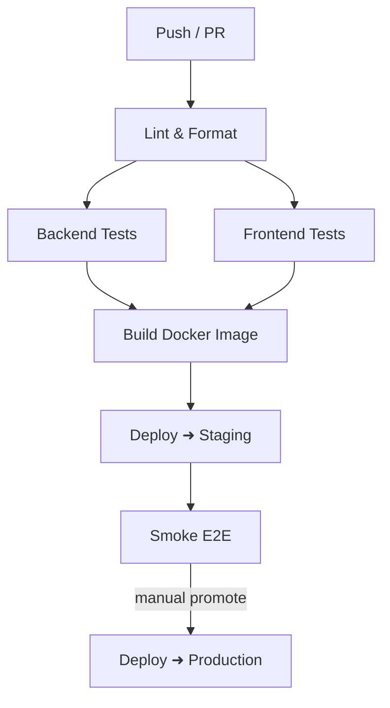

# **Conceptus Veritas Development Guidelines**

**Scope**  
This rule defines engineering best‑practices, project‑specific conventions, and operational procedures for all source code residing in this repository. Adherence is **mandatory** for every pull‑request, regardless of component or runtime.

---

## **1. Universal Coding Principles**

| Principle | TL;DR | Application in this project |
| ----- | ----- | ----- |
| **S**ingle‑Responsibility | A class/module does *one* thing. | Separate API routers, Celery tasks, and React components into focused units. |
| **O**pen‑Closed | Entities are open for extension, closed for modification. | Extend feature‑flags or dependency‑injection to change behaviour without editing core modules. |
| **L**iskov Substitution | Sub‑types must be usable wherever their base is expected. | Prefer Protocols/ABCs over concrete classes when designing service layers. |
| **I**nterface‑Segregation | Smaller, role‑specific interfaces beat huge "god" ones. | Split service contracts (e.g., payment vs. notification) instead of a single `utils.py`. |
| **D**ependency‑Inversion | Depend on abstractions, not concretions. | Inject Redis/Postgres clients via providers; avoid hard‑coding globals. |
| **KISS** | Keep It *Super* Simple. | Favour declarative configs (YAML/TOML) over imperative scripts. |
| **DRY** | Don't Repeat Yourself. | Centralise constants (feature flags, colours, error codes). |
| **YAGNI** | You Aren't Gonna Need It. | Ship only what the PRD demands; resist speculative frameworks. |
| **Fail Fast** | Surface errors early. | Add exhaustive runtime type‑checks where static analysis is insufficient. |
| **Document the *Why*** | Code explains *what*; comments explain *why*. | Leave breadcrumbs for future maintainers. |

## **2. Environment Setup & Dependency Management**

### **2.1 Prerequisites**

* **Python ≥ 3.12** (use `pyenv` or your OS pkg‑manager)
* **Node ≥ 20 LTS**
* **uv** package manager (`pipx install uv`)
* **pnpm ≥ 9** (`corepack enable && corepack prepare pnpm@latest --activate`)
* **Docker & docker‑compose** (local infra)
* **GH CLI** (for secrets & workflows)

### **2.2 First‑time Clone**

```powershell
# 1. Fork & clone  
gh repo clone <org>/conceptus-veritas && cd conceptus-veritas

# 2. Bootstrap Python env  
uv venv  
uv pip install -r requirements.lock

# 3. Bootstrap JS env  
pnpm install

# 4. Spin up local services  
pnpm run dev:infra  # docker-compose up postgres redis supabase-studio

# 5. Run the app-suite  
pnpm run dev  # concurrently starts backend & frontend w/ hot reload
```

### **2.3 Managing Python deps (uv + `pyproject.toml`)**

| Action | Command |
| ----- | ----- |
| **Add** new dep | `uv pip install <pkg>` (auto‑writes to `pyproject.toml` & `requirements.lock`) |
| **Remove** dep | `uv pip uninstall <pkg>` then commit changed lockfile |
| **Upgrade** all | `uv pip install -r requirements.lock --upgrade` |
| **Sync** | `uv pip sync` (CI step) |

### **2.4 Managing JS deps (pnpm)**

| Action | Command |
| ----- | ----- |
| **Add** | `pnpm add <pkg>` / `pnpm add -D <pkg>` |
| **Remove** | `pnpm remove <pkg>` |
| **Upgrade** | `pnpm up --latest` |
| **Audit** | `pnpm audit` (CI step) |

### **2.5 Code Quality Gates**

```powershell
# Python  
uv pip install ruff  
ruff check && ruff format

# Frontend  
pnpm run lint   # ESLint  
pnpm run format # Prettier (auto-fix)
```

**CI enforces zero warnings** – a failing linter/formatter blocks the merge.

---

## **3. Project Layout**

```
repo-root/  
├── apps/  
│   ├── backend/            # FastAPI + Celery source  
│   │   ├── api/            # Route modules  
│   │   ├── core/           # Settings, DI containers, database session  
│   │   ├── services/       # Business logic  
│   │   └── tasks/          # Celery workers  
│   └── frontend/           # React Native + Expo source  
│       ├── app/            # Expo entry  
│       ├── components/     # Shared UI primitives (shadcn)  
│       ├── screens/        # High-level views  
│       └── hooks/          # React hooks  
├── infra/                  # docker-compose, Terraform, SQL migrations  
├── tests/  
│   ├── backend/  
│   └── frontend/  
├── scripts/                # One-off maintainer utilities (bash/py)  
├── .github/workflows/      # GitHub Actions definitions  
├── pyproject.toml          # Python tooling & deps  
├── package.json            # Frontend scripts only (wrapped by pnpm)  
└── README.md
```

*Keep internal imports absolute using the `apps.<module>` namespace; avoid relative `..` hops.*

---

## **4. Technology‑Specific Guidelines**

### **4.1 Python + FastAPI**

* **Typing:** All functions are annotated; enable `mypy --strict`.
* **Routers:** Organise by bounded context (`/auth`, `/payments`).
* **Settings:** Use `pydantic.BaseSettings` pattern; no plain `os.getenv` calls outside `core/settings.py`.
* **Auth:** Prefer JWT (Paseto) via FastAPI‐Users; store secrets in GitHub Secrets & Supabase Vault.
* **Background work:** Offload long‑running jobs to Celery; do **not** block request threads.
* **Pitfalls:** Avoid `orm_mode=True` on large models—prefer explicit DTOs; guard against *SQL injection* by always using SQLAlchemy core/ORM bound params.
* **Resources:** [https://fastapi.tiangolo.com/](https://fastapi.tiangolo.com/)

### **4.2 Celery + Redis**

* **Idempotency:** Tasks must be re‑entrant; use unique `task_id`s.
* **Retries:** Configure exponential backoff; never silent‑fail.
* **Monitoring:** `flower` is bundled in `infra/` compose; check dashboards before escalating.

### **4.3 React Native + Expo**

* **Architecture:** Follow the *Presentational ↔ Container* pattern; keep business logic in hooks.
* **Navigation:** Standardise on *Expo Router* v3; nested layouts mirror the sitemap.
* **Styling:** Tailwind CSS via `nativewind`; no inline style objects.
* **State:** Use `zustand` for lightweight global state; avoid prop‑drilling.
* **APIs:** Query backend through `@tanstack/react‑query` with generated OpenAPI hooks.
* **Pitfalls:** Do not mutate React Query cache directly; always use `setQueryData`.
* **Docs:** [https://docs.expo.dev/](https://docs.expo.dev/) [https://reactnative.dev/](https://reactnative.dev/)

### **4.4 Supabase (PostgreSQL + Realtime)**

* **DB schema:** Defined via `infra/migrations/` – never mutate prod via GUI.
* **RLS:** Every table **must** have Row‑Level Security with JWT claims.
* **Realtime:** Use server‑sent channels sparingly; prefer WebSockets only where latency < 500 ms matters.

### **4.5 Redis Cache**

* **Usage:** Only for ephemeral caching / task queues. No source of truth data.
* **Keys:** Follow `env:feature:resource:id` slug. TTL default 15 min.

### **4.6 Stripe Payments**

* **API Version:** Pin to `2023‑10‑16`.
* **Webhooks:** Validate sigs; enqueue to Celery rather than direct processing.
* **No PCI:** Use Stripe Checkout / Payment Links; we never touch card data.

### **4.7 Posthog Analytics**

* **Events:** Prefix with `ph_` and kebab‑case (`ph_user-login`).
* **Privacy:** PII must be hashed before emission.
* **Sampling:** Keep < 10k events/user/day.

### **4.8 AI Integrations**

* **Providers:** OpenAI (o3), Anthropic (Claude Opus), Groq (LLaMA 3) – all wrapped by `apps/backend/services/ai_gateway.py`.
* **Quotas:** Hard‑limit 20k tokens/request.
* **Prompt design:** Centralise templates in `apps/backend/prompts/`; document *system* vs *user* contexts.

---

## **5. Testing & CI/CD**

### **5.1 Testing Pyramid**

| Layer | Tooling | Target | Expected Coverage |
| ----- | ----- | ----- | ----- |
| Unit | `pytest`, `pytest‑asyncio` | Pure functions, services | ≥ 90% lines |
| Component | React Testing Library + Jest | RN components, hooks | Snapshot + behaviour |
| Integration | `pytest` + docker‑compose | DB, Redis, Supabase | CI only |
| E2E | Playwright (web preview) | Critical flows | Smoke‑only |

*Run `pnpm test` before every push.* CI gate blocks < 90% unit coverage or any failing snapshot.

### **5.2 GitHub Actions Pipeline**



* **Secrets:** Managed via GitHub Environments (staging, production).
* **Branching:** Trunk‑based on `main`; feature branches must rebase before merge.
* **Feature Flags:** Use `apps/backend/core/flags.py` + `apps/frontend/lib/flags.ts`. Unfinished code is guarded behind a disabled flag – *never* long‑lived branches.

---

## **6. Documentation**

| Artifact | Where | Style | Owner |
| ----- | ----- | ----- | ----- |
| **Docstrings** | Python/TS code | Google style / TSDoc | Author |
| **README.md** | Each package | Usage, examples, badges | Package maintainer |
| **ADR** | `docs/adr/NNN‑title.md` | [adr‑tools](https://github.com/npryce/adr%E2%80%91tools) | Reviewer |
| **High‑level** | `docs/` Docusaurus site | Markdown + Mermaid | Tech Writer |

*Update docs **in the same PR** that changes behaviour.* Broken docs are bugs.

---

## **7. Violations & Exemptions**

* CI will block non‑compliant commits.
* Temporary exemptions require an `# pragma: no‑cover` or `eslint‑disable` *plus* a linked GitHub issue describing the debt.
* Exemptions expire after **2 sprints**.

---

✅ **You are now ready to ship.** For questions, tag `@dev‑experience` in Slack or open a *Discussion → Q&A*. 