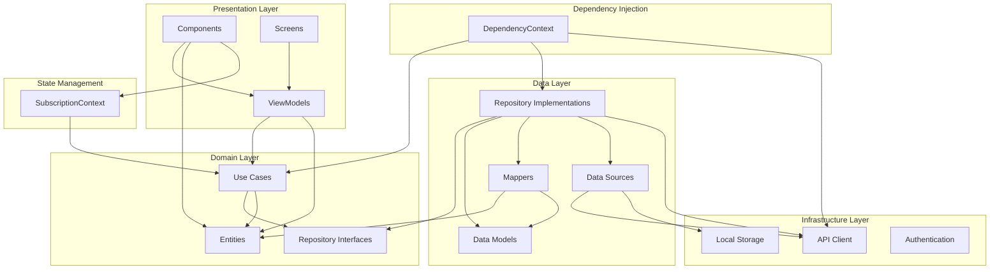

# Dependency Graph Verification & Best Practices Report

## Executive Summary

This report presents the findings of a comprehensive dependency graph verification for the Conceptus Veritas application. The analysis focused on ensuring proper architectural layering, adherence to SOLID principles, and alignment with industry best practices. Overall, the codebase demonstrates a well-structured Clean Architecture approach with clear separation of concerns, though several areas for improvement have been identified.

## Architecture Overview

The application follows a layered architecture with the following components:

```
src/
├── presentation/       # UI layer (React components, screens)
├── domain/            # Business logic and entities
├── data/              # Data access implementation
├── infrastructure/    # External services and utilities
├── contexts/          # React contexts for state management
├── components/        # Shared UI components
├── hooks/             # Custom React hooks
└── utils/             # Utility functions
```

## Dependency Graph Visualization

The following diagram illustrates the current dependency relationships between the different layers and components of the application:



This visualization confirms that the application follows Clean Architecture principles, with dependencies pointing inward toward the domain layer. The presentation layer depends on the domain layer but not on the data or infrastructure layers, maintaining proper separation of concerns.

## Dependency Flow Analysis

### Correct Dependency Flow

The application largely follows the correct dependency flow according to Clean Architecture principles:

- **Presentation Layer** → depends on → **Domain Layer**
- **Data Layer** → implements → **Domain Layer** interfaces
- **Infrastructure Layer** → provides services to → **Data Layer**

This ensures that business logic remains independent of UI and external systems, promoting testability and maintainability.

### Dependency Injection

The application implements dependency injection through React's Context API:

- `DependencyContext.tsx` serves as a centralized dependency container
- Dependencies are properly injected rather than directly instantiated in components
- This facilitates testing and allows for easy substitution of implementations

## Detailed Findings

### 1. Layer Adherence Verification

| Layer          | Correct Dependencies   | Findings                                                                    |
| -------------- | ---------------------- | --------------------------------------------------------------------------- |
| Presentation   | Domain                 | ✅ Components correctly depend on domain entities and use cases             |
| Domain         | None (self-contained)  | ✅ No external dependencies in domain entities                              |
| Data           | Domain, Infrastructure | ✅ Repositories implement domain interfaces and use infrastructure services |
| Infrastructure | External libraries     | ✅ Properly encapsulates external dependencies                              |

### 2. SOLID Principles Adherence

| Principle             | Status   | Examples                                                                     |
| --------------------- | -------- | ---------------------------------------------------------------------------- |
| Single Responsibility | ✅ Good  | Each class has a clear, focused purpose (e.g., `SubscriptionRepositoryImpl`) |
| Open/Closed           | ✅ Good  | Extension through interfaces rather than modification                        |
| Liskov Substitution   | ✅ Good  | Implementations properly fulfill their interfaces                            |
| Interface Segregation | ⚠️ Mixed | Some interfaces could be more granular                                       |
| Dependency Inversion  | ✅ Good  | Domain defines interfaces, data layer implements them                        |

### 3. State Management Assessment

The application uses React Context for state management, which is appropriate for the current complexity level. As the application grows, consider:

- For complex screens with multiple state transitions: Consider BLoC pattern or Redux with proper middleware
- For simpler screens: Current MVVM-like approach with React hooks is sufficient
- For global state: Current Context API implementation works well but could benefit from more granular contexts

### 4. Library Usage Analysis

| Library          | Usage             | Assessment                                             |
| ---------------- | ----------------- | ------------------------------------------------------ |
| React Navigation | Navigation        | ✅ Industry standard, properly implemented             |
| Redux Toolkit    | State management  | ✅ Modern Redux implementation, follows best practices |
| Axios            | HTTP client       | ✅ Well-encapsulated in ApiClient                      |
| Winston          | Logging           | ✅ Properly structured for production use              |
| Express          | Backend framework | ✅ Standard implementation                             |

## Identified Issues and Recommendations

### 1. Interface Granularity

**Issue**: Some interfaces like `SubscriptionRepository` contain many methods, potentially violating the Interface Segregation Principle.

**Recommendation**: Consider splitting into more focused interfaces:

```typescript
// Example refactoring
interface SubscriptionAccessRepository {
  getUserSubscription(userId: string): Promise<SubscriptionTier>;
  getAllTiers(): Promise<SubscriptionTier[]>;
}

interface SubscriptionManagementRepository {
  upgradeTier(userId: string, tierId: string): Promise<boolean>;
  downgradeTier(userId: string, tierId: string): Promise<boolean>;
}

interface FeatureAccessRepository {
  hasFeatureAccess(userId: string, featureId: string): Promise<boolean>;
  getFeatureUsageLimit(userId: string, featureId: string): Promise<number | undefined>;
  // ...
}
```

### 2. Error Handling Consistency

**Issue**: Error handling is inconsistent across repositories and use cases.

**Recommendation**: Implement a consistent error handling strategy:

- Define domain-specific error types
- Ensure consistent error propagation
- Add proper error logging with context

Example:

```typescript
export class SubscriptionError extends Error {
  constructor(
    message: string,
    public readonly code: string
  ) {
    super(message);
    this.name = 'SubscriptionError';
  }

  static notFound(userId: string): SubscriptionError {
    return new SubscriptionError(`Subscription not found for user ${userId}`, 'SUB_NOT_FOUND');
  }
}
```

### 3. Type Safety Improvements

**Issue**: Some areas use `any` type, reducing type safety.

**Recommendation**: Replace `any` with proper types:

```typescript
// Before
private authService: any;

// After
private authService: AuthService;

interface AuthService {
  getToken(): string | null;
  // other auth methods
}
```

### 4. Testing Structure

**Issue**: Test coverage and structure could not be fully assessed.

**Recommendation**: Ensure comprehensive test coverage:

- Unit tests for domain logic
- Integration tests for repositories
- Component tests for UI
- End-to-end tests for critical flows

## Dependency Inversion Opportunities

1. **Auth Service Abstraction**:

   - Create an `AuthService` interface in the domain layer
   - Move implementation to infrastructure layer
   - This removes the dependency on concrete auth implementation

2. **API Client Abstraction**:
   - Define a `HttpClient` interface in the domain layer
   - Make `ApiClient` implement this interface
   - Repositories should depend on the interface, not the concrete class

## Conclusion

The application demonstrates a well-structured architecture with clear separation of concerns. The dependency flow generally follows Clean Architecture principles, ensuring that business logic remains independent of UI and external systems.

Key strengths include:

- Proper layering with clear responsibilities
- Effective use of dependency injection
- Strong domain modeling

Areas for improvement include:

- More granular interfaces
- Consistent error handling
- Improved type safety
- Enhanced testing structure

By addressing these recommendations, the application will be better positioned for maintainability, testability, and scalability as it grows in complexity.

## Next Steps

1. Implement interface segregation for larger repository interfaces
2. Create a consistent error handling strategy
3. Replace `any` types with proper interfaces
4. Enhance test coverage across all layers
5. Apply dependency inversion to auth and API client services
